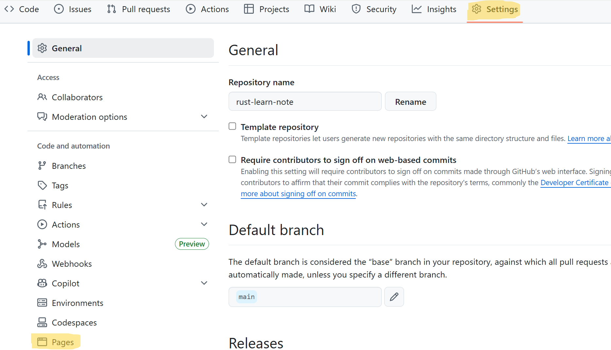
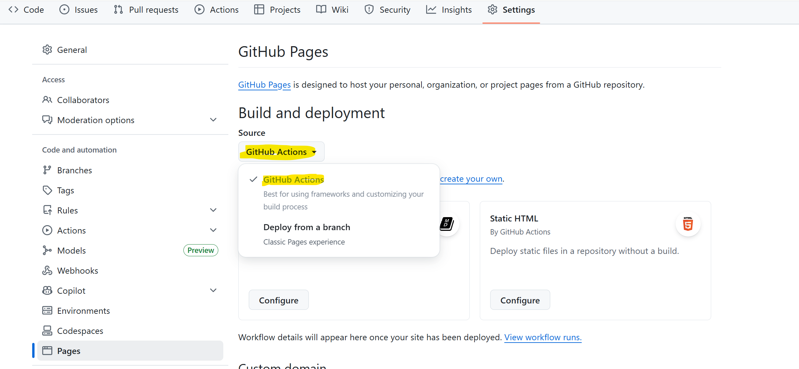
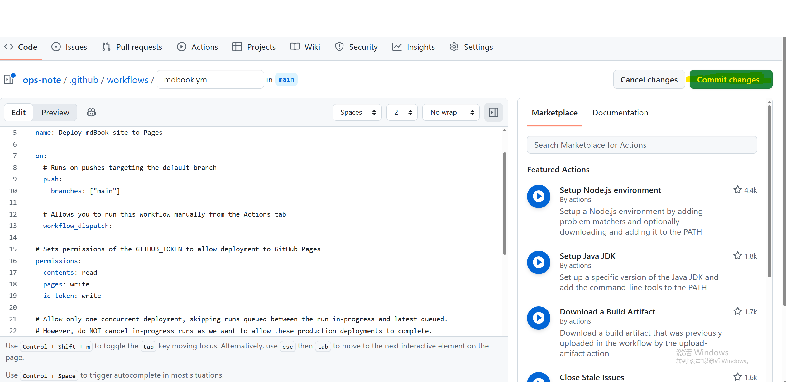

# mdbook

mdBook 是一个用于使用 Markdown 创建书籍的命令行工具。它非常适合用于创建产品或 API 文档、教程、课程材料或任何需要清晰、易于导航且可自定义呈现的内容。

[官方文档](https://rust-lang.github.io/mdBook/index.html)  

* 安装
`cargo install mdbook`  
!!! 注意 rust 版本，有时可能需要最新版才可以


* 卸载
`cargo uninstall mdbook.`

* 创建一本书
```bash
# 初始化
$ mdbook init my-first-book
# 进入目录
$ cd my-first-book
# 启动本地服务
$ mdbook serve --open
```

## github 发布 mdbook

工具：
* Github Actions
* Github Pages

### github 仓库中找到 setting 点击 pages（黄色标记部分）。



### Build and deployment 下面选择 Github actions, 选择 mdbook



### 使用默认提供的 mdbook actions 配置文件即可，点击 "commit changes"



提交后自动进行构建，github pages 地址为 `用户名.github.io/仓库名/`

## 后端工具

### mdbook-pdf

[官方仓库](https://github.com/HollowMan6/mdbook-pdf/tree/main)

> 经测试，若网页版内容需拖动滑块浏览转换为 pdf 格式显示观感不好不建议使用。  

#### 安装使用步骤（以下步骤默认已经有 Rust 环境并且安装 mdbook）

安装 mdbook-pdf   
`cargo install mdbook-pdf`

修改 `book.toml` 配置文件最少需要包含一下内容
```text
[book]
title = "你的书籍标题"

[output.html]  # 启用 HTML 输出

[output.pdf]   # 启用 PDF 输出后端
```

构建  
`mdbook build`  
使用默认配置，构建好的 pdf 文件会在 book/pdf/ 目录下。  


